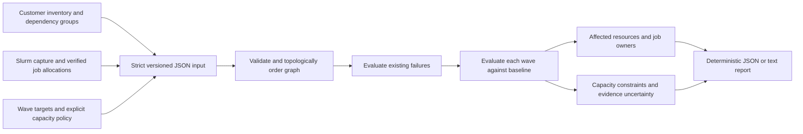

# Architecture and decision semantics

FabricChange is a pure offline evaluator with a small command-line wrapper. The CLI opens only the explicitly named input file (or stdin); it makes no network calls and executes no subprocess. A separate Bash script contains read-only Slurm commands and emits an allocation capture for the offline parser.

## Data flow

`model.go` defines the public contract. `decode.go` enforces size and syntax limits. `validate.go` checks identity and graph integrity. `evaluate.go` propagates resource availability and evaluates jobs and budgets. `slurm.go` imports the limited documented allocation format. `cmd/fabricchange` handles files, reference time, rendering, and exit codes.

## Availability algebra

A resource is down if its own observed status is down, it is targeted by the wave, or a required group cannot attain its minimum even if every unknown member becomes available. A group is satisfied if its known-up count meets its minimum. Otherwise, if known-up plus unknown can meet the minimum, the group is unknown. All dependency groups must be satisfied. Down dominates unknown, which dominates up.

This is a discrete declared-availability model. It does not infer bandwidth, queueing, storage performance, dynamic routing, or correlated failure probability. Model actual shared dependencies explicitly; two links behind the same failed switch are not independent just because both are listed.

Each active job depends on every resource in its allocation. One down resource blocks the job; an unknown resource makes the job impact unknown unless a down resource already blocks it. Running, suspended, and completing states are active. Pending and terminal states are not active allocations. The planner does not predict when a job ends, checkpoints, migrates, or can be requeued.

## Waves, baseline, and policy

All wave targets are unavailable simultaneously. Each wave is evaluated separately against the initial snapshot, with every existing down resource retained. `prior_wave_restored: true` is required as an explicit acknowledgement that all preceding wave targets will have been fully restored and revalidated before the next wave starts. This tool does not measure restoration or simulate recovery duration. It does not produce an execution schedule.

The global compute-node budget counts effective down compute resources, including existing outages and indirect dependency failures. If down plus unknown nodes might exceed the budget, the outcome is unknown. A domain minimum blocks when healthy plus unknown is insufficient; otherwise insufficient known health is unknown. Compute resources may be in overlapping domains. Each domain counts each node once; domain `*` is reserved for the global summary.

Missing optional capacity policies impose no corresponding constraint. Resource unavailability alone does not block if there are no affected active jobs and no violated explicit policy; it remains visible in `affected_resources`. Pass means only that the selected checks passed, never that arbitrary downtime is acceptable.

## Evidence quality and deterministic output

Explicitly false completeness, nonempty missing scopes, future timestamps, excessive age, or any declared unknown resource status prevents a pass. Caller-declared completeness is not independently verified. Known blockers remain blocked even with poor evidence; the separate snapshot findings preserve that uncertainty.

Resources, jobs, targets, groups, and capacity domains are rendered in stable identifier order. Wave order is preserved because it is user intent. Output contains its evaluation and snapshot timestamps. Supply `-at` for exact replay; real usage defaults to current UTC. JSON numbers for counts and minima must be integers. Unknown fields, duplicate JSON keys, duplicate IDs, unknown references, cycles, missing active allocations, and omitted job inventory are errors.

Input is capped at 16 MiB, 64 JSON nesting levels, 100,000 resources, 100,000 jobs, 1,000,000 dependency-member occurrences, and 100 waves. Stricter combined work limits require `(resources + jobs + distinct compute domains) * (waves + 1 baseline) <= 30,000` and `(dependency memberships + job allocation references + domain memberships) * (waves + 1 baseline) <= 500,000`; split larger assessments. Topological traversal is iterative so a deep graph cannot overflow the evaluator stack. Diagnostic causes are capped at 16 per affected resource and paths at 64 IDs, with a shared 4 MiB diagnostic budget charging text and conservative serialization overhead across baseline and all waves, and explicit truncation indicators. Resource/job summary records are additional to that diagnostic budget. Truncating explanations does not truncate availability evaluation. These are pre-alpha sizing limits, not production performance guarantees.

## Cost and validation

Per wave, availability propagation and job/capacity checks are proportional to graph membership and allocations, plus deterministic sorting and bounded cause copying. Every wave is evaluated independently. The generated 1,000 and 10,000-compute-node benchmarks use shared storage, redundant fabric, and active allocation fixtures. They measure local CPU planner cost, not network collection cost, scheduler behavior, GPU throughput, or correctness on a real installation.

## Integration limitations

The Slurm import format contains start and finish timestamps and a required completion footer. It intentionally emits `complete: false`: allocation capture cannot provide resource health or dependency inventory. It does not implement vendor-specific NMX/UFM, storage, BMC, or scheduler REST adapters. Live collection and hardware validation are pending.

Reservations require separate operational review: Slurm's maintenance reservation flags have specific overlap and running-job semantics. FabricChange does not parse them and cannot certify a plan against them. [Slurm reservation guide](https://slurm.schedmd.com/reservations.html).
